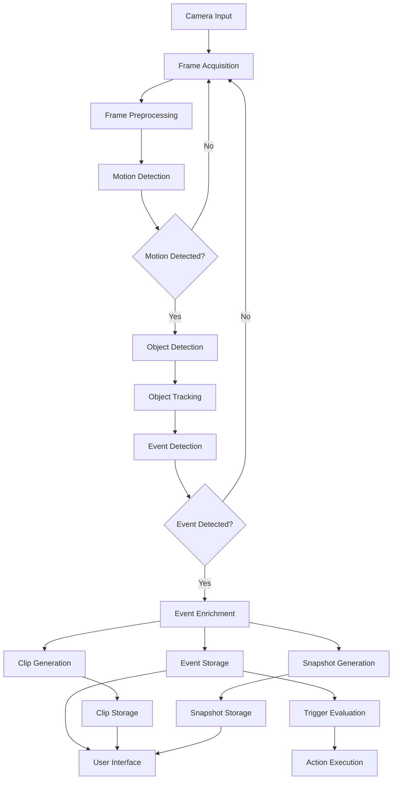
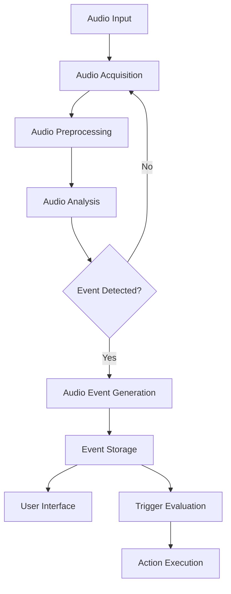
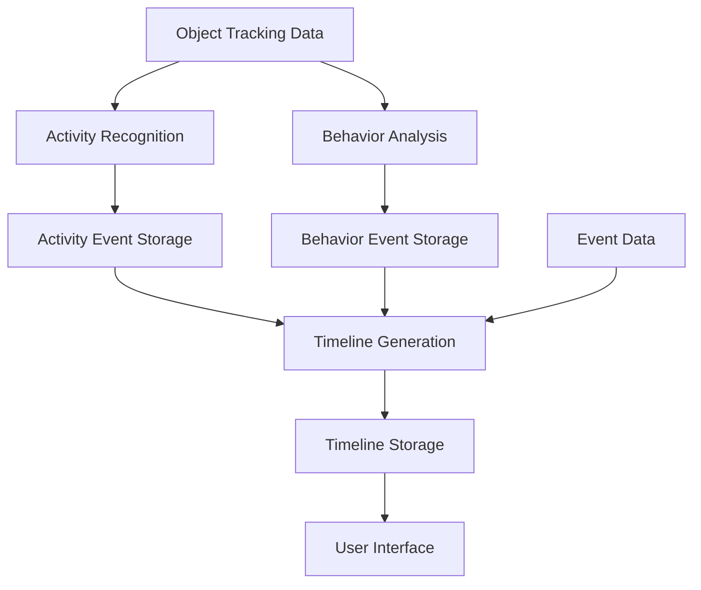
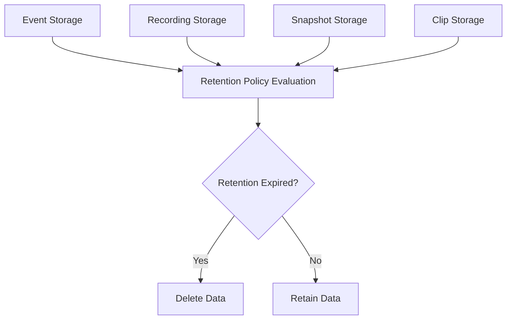

# Data Flow

This document outlines the data flow in the Arkos AI system, describing how data moves through the system from input sources to storage and user interface.

## Overview

Arkos AI processes data from multiple sources, primarily IP cameras, and transforms this data through various processing stages before presenting it to users or triggering actions. The system is designed to be efficient, processing only the necessary data at each stage to minimize resource usage.

## High-Level Data Flow

At a high level, data flows through the system as follows:

```
Camera Input → Video Processing → Object Detection → Event Generation → Storage → User Interface
```

Additional flows include:

```
Audio Input → Audio Processing → Audio Event Detection → Event Generation → Storage → User Interface
```

```
Events → Analytics Processing → Timeline Generation → Storage → User Interface
```

```
Events → Trigger Evaluation → Action Execution → IO Devices
```

## Detailed Data Flow

### Camera Input

1. **Camera Connection**:
   - IP cameras connect to the system via RTSP, HTTP, or other protocols
   - Camera feeds are configured in the system configuration
   - The system establishes connections to the cameras

2. **Frame Acquisition**:
   - Frames are acquired from the cameras at configured intervals
   - For detection, frames are typically acquired at a lower frame rate (e.g., 5 FPS)
   - For recording, frames may be acquired at a higher frame rate (e.g., 30 FPS)

3. **Frame Preprocessing**:
   - Frames are resized to the configured resolution for detection
   - Frames are converted to the appropriate format for processing
   - Frames may be cropped to regions of interest

### Video Processing

1. **Motion Detection**:
   - Frames are analyzed for motion using efficient algorithms
   - Motion detection is performed on specific regions of interest
   - Motion detection results determine whether to proceed with object detection

2. **Frame Buffering**:
   - Frames are buffered in memory for a short period
   - Buffering allows for pre-event recording
   - Buffer size is configurable based on available memory

### Object Detection

1. **Detection Preparation**:
   - Frames with detected motion are prepared for object detection
   - Frames are formatted according to the requirements of the detection model
   - Multiple detection models may be used for different object types

2. **Model Inference**:
   - Detection models process the frames to identify objects
   - Hardware acceleration (GPU, TPU, etc.) may be used for inference
   - Detection results include object type, confidence, and bounding box

3. **Object Tracking**:
   - Detected objects are tracked across frames
   - Tracking assigns consistent IDs to objects
   - Tracking algorithms predict object movement between frames

### Event Generation

1. **Event Detection**:
   - Events are detected based on object detection and tracking results
   - Events are triggered when objects enter or exit zones
   - Events have a start time, end time, and associated metadata

2. **Event Enrichment**:
   - Events are enriched with additional data
   - Enrichment may include snapshots, clips, and analytics data
   - Enhanced analytics may be applied to events

### Audio Processing

1. **Audio Acquisition**:
   - Audio is acquired from camera microphones or dedicated audio devices
   - Audio is processed in chunks for real-time analysis
   - Audio may be buffered for pre-event recording

2. **Audio Analysis**:
   - Audio is analyzed for specific patterns or events
   - Analysis may include frequency analysis, pattern recognition, etc.
   - Audio events are detected based on analysis results

3. **Audio Event Generation**:
   - Audio events are generated based on analysis results
   - Events include type, timestamp, duration, and confidence
   - Audio events may be correlated with video events

### Analytics Processing

1. **Activity Recognition**:
   - Object tracking data is analyzed to recognize activities
   - Activities may include walking, running, loitering, etc.
   - Activity recognition results are stored as activity events

2. **Behavior Analysis**:
   - Activity data is analyzed to identify behavioral patterns
   - Patterns may include routine activities, anomalies, etc.
   - Behavior analysis results are stored as behavior events

3. **Timeline Generation**:
   - Events, activities, and behaviors are combined to generate a timeline
   - Timeline provides a chronological view of all events
   - Timeline may be filtered by camera, event type, etc.

### Storage

1. **Event Storage**:
   - Events are stored in the database with associated metadata
   - Event data includes camera ID, object type, timestamps, etc.
   - Events may be linked to snapshots and clips

2. **Recording Storage**:
   - Video recordings are stored on disk in configurable formats
   - Recordings may be continuous or event-based
   - Recordings are organized by camera and time

3. **Snapshot Storage**:
   - Event snapshots are stored on disk as image files
   - Snapshots capture the key frame of an event
   - Snapshots are linked to events in the database

4. **Clip Storage**:
   - Event clips are stored on disk as video files
   - Clips include pre-event and post-event footage
   - Clips are linked to events in the database

5. **Retention Management**:
   - Storage is managed according to retention policies
   - Policies may be based on time, storage space, or event type
   - Old recordings and events are automatically deleted

### User Interface

1. **Live View**:
   - Camera feeds are streamed to the user interface
   - Live view may include object detection overlays
   - Multiple camera feeds may be viewed simultaneously

2. **Event Review**:
   - Events are presented in a searchable and filterable interface
   - Events may be viewed with associated snapshots and clips
   - Events may be tagged, commented on, or marked as false positives

3. **Timeline View**:
   - Timeline provides a chronological view of events
   - Timeline may be filtered by camera, event type, etc.
   - Timeline allows for easy navigation of events

4. **Analytics Dashboard**:
   - Analytics data is presented in a dashboard interface
   - Dashboard includes charts, graphs, and statistics
   - Dashboard may be customized for specific use cases

### Trigger and Action System

1. **Trigger Evaluation**:
   - Events are evaluated against configured triggers
   - Triggers may be based on event type, camera, zone, etc.
   - Trigger evaluation results in action execution

2. **Action Execution**:
   - Actions are executed based on trigger evaluation
   - Actions may include controlling IO devices, sending notifications, etc.
   - Actions may be scheduled or event-driven

3. **Notification Delivery**:
   - Notifications are delivered through configured channels
   - Channels may include webhooks, email, push notifications, etc.
   - Notifications include event details and links to snapshots/clips

## Data Flow Diagrams

### Video Processing Flow



### Audio Processing Flow



### Analytics Processing Flow



### Storage Management Flow



## Data Transformation

As data flows through the system, it undergoes various transformations:

1. **Raw Frame → Processed Frame**:
   - Resizing
   - Format conversion
   - Normalization

2. **Processed Frame → Detection Result**:
   - Object detection
   - Bounding box calculation
   - Confidence scoring

3. **Detection Result → Tracked Object**:
   - ID assignment
   - Position tracking
   - Trajectory calculation

4. **Tracked Object → Event**:
   - Event type determination
   - Zone intersection calculation
   - Metadata collection

5. **Event → Enriched Event**:
   - Snapshot generation
   - Clip generation
   - Analytics enrichment

6. **Raw Audio → Audio Event**:
   - Frequency analysis
   - Pattern recognition
   - Event classification

7. **Events → Timeline**:
   - Chronological ordering
   - Event correlation
   - Activity summarization

## Performance Considerations

The data flow is designed with performance in mind:

1. **Selective Processing**:
   - Object detection is only performed on frames with detected motion
   - Processing is focused on regions of interest
   - Analytics are applied selectively based on configuration

2. **Parallel Processing**:
   - Multiple cameras are processed in parallel
   - Detection and recording processes run independently
   - Analytics processing can be offloaded to separate processes

3. **Resource Management**:
   - Memory usage is controlled through buffer management
   - CPU/GPU resources are allocated based on priority
   - Storage is managed through retention policies

4. **Optimized Storage**:
   - Recordings use efficient codecs and formats
   - Events are stored with minimal metadata
   - Indexes are used for efficient querying

## Data Security

Data security is maintained throughout the flow:

1. **Authentication**:
   - Camera connections require authentication
   - API access requires authentication
   - User interface access requires authentication

2. **Encryption**:
   - Camera connections may use encrypted protocols
   - API communications use HTTPS
   - Stored data may be encrypted

3. **Access Control**:
   - User permissions control access to data
   - API endpoints enforce access control
   - Storage access is restricted

## Error Handling

Error handling is implemented at various stages:

1. **Camera Connection Errors**:
   - Connection failures are detected and reported
   - Reconnection is attempted automatically
   - Errors are logged for troubleshooting

2. **Processing Errors**:
   - Detection failures are handled gracefully
   - Processing errors are logged
   - System continues to function despite errors

3. **Storage Errors**:
   - Storage failures are detected and reported
   - Alternative storage paths may be used
   - Critical data is prioritized

## Monitoring and Logging

The data flow is monitored and logged:

1. **Performance Monitoring**:
   - Processing times are measured and reported
   - Resource usage is monitored
   - Bottlenecks are identified

2. **Error Logging**:
   - Errors are logged with context
   - Log levels control verbosity
   - Logs are rotated to manage size

3. **Audit Logging**:
   - User actions are logged
   - System changes are logged
   - Access to sensitive data is logged

## Conclusion

The data flow in Arkos AI is designed to efficiently process video and audio data from cameras, detect objects and events, store relevant data, and present it to users through an intuitive interface. The system is optimized for performance, security, and reliability, with comprehensive error handling and monitoring.
