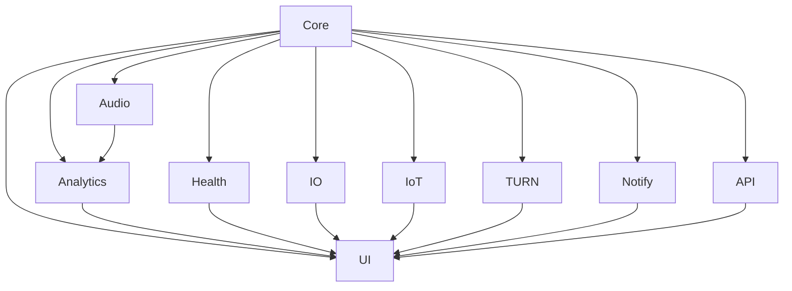

# Dependency Graph

This document outlines the dependency relationships between the various modules and components of the Arkos AI system. Understanding these dependencies is crucial for prioritizing development and ensuring that components are implemented in the correct order.

## Overview

The Arkos AI system consists of multiple modules that interact with each other. Some modules are foundational and must be implemented first, while others build upon these foundations. The dependency graph helps visualize these relationships and identify the critical path for development.

## High-Level Dependencies

At a high level, the dependencies between the major modules are as follows:

## Detailed Dependency Graph

The following graph shows the detailed dependencies between components within each module:

```mermaid
graph TD
    %% Core Module Components
    CoreCamera[Core: Camera Management] --> CoreDetect[Core: Object Detection]
    CoreCamera --> CoreRecord[Core: Recording Management]
    CoreDetect --> CoreEvent[Core: Event Management]
    CoreRecord --> CoreEvent
    CoreEvent --> CoreStorage[Core: Storage Management]
    CoreStorage --> CoreAPI[Core: API Endpoints]
    CoreAPI --> CoreUI[Core: Basic UI]
    
    %% Analytics Module Components
    CoreDetect --> AnalyticsVideo[Analytics: Video Analytics]
    CoreEvent --> AnalyticsVideo
    CoreCamera --> AnalyticsAudio[Analytics: Audio Analytics]
    AnalyticsVideo --> AnalyticsActivity[Analytics: Activity Recognition]
    AnalyticsAudio --> AnalyticsActivity
    AnalyticsActivity --> AnalyticsBehavior[Analytics: Behavior Analysis]
    AnalyticsVideo --> AnalyticsMultimodal[Analytics: Multi-modal Integration]
    AnalyticsAudio --> AnalyticsMultimodal
    AnalyticsActivity --> AnalyticsTimeline[Analytics: Timeline Generation]
    AnalyticsBehavior --> AnalyticsTimeline
    
    %% Health Module Components
    CoreCamera --> HealthConnectivity[Health: Connectivity Monitoring]
    CoreDetect --> HealthQuality[Health: Quality Monitoring]
    HealthConnectivity --> HealthAlerts[Health: Alert Generation]
    HealthQuality --> HealthAlerts
    
    %% Audio Module Components
    CoreCamera --> AudioCapture[Audio: Audio Capture]
    AudioCapture --> AudioProcessing[Audio: Audio Processing]
    AudioProcessing --> AudioPlayback[Audio: Audio Playback]
    AudioProcessing --> AnalyticsAudio
    
    %% IO Module Components
    CoreEvent --> IOTriggers[IO: Trigger Management]
    IOTriggers --> IOHardware[IO: Hardware Integration]
    IOTriggers --> IOMQTT[IO: MQTT Integration]
    IOHardware --> IOScheduler[IO: Scheduler]
    IOMQTT --> IOScheduler
    
    %% IoT Module Components
    IOMQTT --> IoTProtocols[IoT: Protocol Support]
    IoTProtocols --> IoTDevices[IoT: Device Management]
    IoTDevices --> IoTAutomation[IoT: Automation Engine]
    
    %% TURN Module Components
    CoreCamera --> TURNServer[TURN: Server Integration]
    TURNServer --> TURNWebRTC[TURN: WebRTC Support]
    TURNWebRTC --> TURNRemote[TURN: Remote Access]
    
    %% Notify Module Components
    CoreEvent --> NotifyWebhooks[Notify: Webhook Management]
    NotifyWebhooks --> NotifyDelivery[Notify: Notification Delivery]
    
    %% API Module Components
    CoreAPI --> APIRest[API: REST Endpoints]
    CoreAPI --> APIWebsocket[API: WebSocket Endpoints]
    APIRest --> APIAuth[API: Authentication]
    APIWebsocket --> APIAuth
    
    %% UI Module Components
    CoreUI --> UILive[UI: Live View]
    CoreUI --> UIEvents[UI: Event Review]
    AnalyticsTimeline --> UITimeline[UI: Timeline View]
    HealthAlerts --> UIDashboard[UI: Dashboard]
    AnalyticsActivity --> UIDashboard
    AnalyticsBehavior --> UIDashboard
    IOScheduler --> UIControl[UI: Control Panel]
    IoTAutomation --> UIControl
    TURNRemote --> UIRemote[UI: Remote Access]
    NotifyDelivery --> UINotifications[UI: Notifications]
    APIAuth --> UIAuth[UI: Authentication]
```

## Module Dependencies

### Core Module Dependencies

The Core module is the foundation of the system and has minimal external dependencies:

- **Camera Management**:
  - External IP cameras
  - FFmpeg for video processing
  - Network connectivity

- **Object Detection**:
  - TensorFlow or PyTorch for detection models
  - Hardware acceleration (optional)

- **Recording Management**:
  - Storage system
  - FFmpeg for video encoding

- **Event Management**:
  - Database for event storage

- **Storage Management**:
  - File system
  - Database

- **API Endpoints**:
  - Web server
  - Authentication system

- **Basic UI**:
  - Web browser
  - JavaScript runtime

### Analytics Module Dependencies

The Analytics module depends on the Core module and adds:

- **Video Analytics**:
  - Core Object Detection
  - Custom detection models

- **Audio Analytics**:
  - Audio processing libraries
  - Audio classification models

- **Activity Recognition**:
  - Object tracking data
  - Machine learning models

- **Behavior Analysis**:
  - Activity data
  - Pattern recognition algorithms

- **Multi-modal Integration**:
  - Video and audio event correlation

- **Timeline Generation**:
  - Event data
  - Activity and behavior data

### Health Module Dependencies

The Health module depends on the Core module and adds:

- **Connectivity Monitoring**:
  - Network monitoring tools
  - Camera connection status

- **Quality Monitoring**:
  - Image analysis algorithms
  - Reference images

- **Alert Generation**:
  - Notification system
  - Alert thresholds

### Audio Module Dependencies

The Audio module depends on the Core module and adds:

- **Audio Capture**:
  - Audio input devices
  - Audio processing libraries

- **Audio Processing**:
  - Audio analysis algorithms
  - Audio event detection

- **Audio Playback**:
  - Audio output devices
  - Audio streaming

### IO Module Dependencies

The IO module depends on the Core module and adds:

- **Trigger Management**:
  - Event data
  - Trigger conditions

- **Hardware Integration**:
  - GPIO libraries
  - Hardware devices

- **MQTT Integration**:
  - MQTT broker
  - MQTT client libraries

- **Scheduler**:
  - Time-based scheduling
  - Condition-based scheduling

### IoT Module Dependencies

The IoT module depends on the IO module and adds:

- **Protocol Support**:
  - ZigBee, Z-Wave, WiFi, Bluetooth libraries
  - Protocol bridges

- **Device Management**:
  - Device discovery
  - Device control

- **Automation Engine**:
  - Rule engine
  - Automation conditions

### TURN Module Dependencies

The TURN module depends on the Core module and adds:

- **Server Integration**:
  - TURN server
  - ICE protocol

- **WebRTC Support**:
  - WebRTC libraries
  - Media streaming

- **Remote Access**:
  - Authentication
  - Encryption

### Notify Module Dependencies

The Notify module depends on the Core module and adds:

- **Webhook Management**:
  - HTTP client
  - Webhook configuration

- **Notification Delivery**:
  - Email, push notification libraries
  - Notification templates

### API Module Dependencies

The API module depends on the Core module and adds:

- **REST Endpoints**:
  - REST framework
  - API documentation

- **WebSocket Endpoints**:
  - WebSocket server
  - Real-time communication

- **Authentication**:
  - JWT or API key management
  - User management

### UI Module Dependencies

The UI module depends on all other modules and adds:

- **Live View**:
  - Video streaming
  - WebRTC or HLS

- **Event Review**:
  - Event data
  - Video playback

- **Timeline View**:
  - Timeline data
  - Interactive visualization

- **Dashboard**:
  - Analytics data
  - Charting libraries

- **Control Panel**:
  - IO and IoT control
  - Configuration management

- **Remote Access**:
  - WebRTC
  - Mobile responsiveness

- **Notifications**:
  - Browser notifications
  - Mobile push notifications

- **Authentication**:
  - User login
  - Role-based access control

## Development Prioritization

Based on the dependency graph, the following prioritization is recommended for development:

### Phase 1: Core Foundation

1. **Camera Management**:
   - Camera connection
   - Frame acquisition
   - Frame preprocessing

2. **Object Detection**:
   - Motion detection
   - Object detection
   - Object tracking

3. **Recording Management**:
   - Frame buffering
   - Video recording
   - Storage management

4. **Event Management**:
   - Event detection
   - Event storage
   - Event retrieval

5. **Storage Management**:
   - Database schema
   - File storage
   - Retention policies

6. **Basic API**:
   - Core endpoints
   - Basic authentication
   - API documentation

7. **Basic UI**:
   - Live view
   - Event review
   - Basic configuration

### Phase 2: Enhanced Analytics

1. **Video Analytics**:
   - Custom detection models
   - Enhanced object tracking
   - Object classification

2. **Audio Capture and Processing**:
   - Audio acquisition
   - Basic audio analysis
   - Audio event detection

3. **Health Monitoring**:
   - Connectivity monitoring
   - Basic quality monitoring
   - Alert generation

4. **IO Foundation**:
   - Hardware integration
   - MQTT integration
   - Basic trigger system

### Phase 3: Advanced Features

1. **Activity Recognition**:
   - Activity detection
   - Activity classification
   - Activity storage

2. **Audio Analytics**:
   - Advanced audio analysis
   - Speech recognition
   - Audio classification

3. **Behavior Analysis**:
   - Pattern recognition
   - Anomaly detection
   - Behavior storage

4. **Timeline Generation**:
   - Event correlation
   - Timeline visualization
   - Timeline filtering

5. **Advanced IO**:
   - Advanced triggers
   - Scheduling system
   - Complex actions

### Phase 4: Integration and Extensions

1. **Multi-modal Integration**:
   - Video and audio correlation
   - Enhanced event detection
   - Confidence boosting

2. **IoT Integration**:
   - Protocol support
   - Device management
   - Automation engine

3. **TURN Server**:
   - Server setup
   - WebRTC integration
   - Remote access

4. **Notification System**:
   - Webhook management
   - Notification delivery
   - Notification templates

### Phase 5: Advanced UI and API

1. **Advanced API**:
   - WebSocket endpoints
   - Advanced authentication
   - API rate limiting

2. **Advanced UI**:
   - Dashboard
   - Control panel
   - Mobile responsiveness
   - Remote access

## Critical Path

The critical path for development is:

1. Core Camera Management
2. Core Object Detection
3. Core Event Management
4. Core Storage Management
5. Core API
6. Core UI
7. Analytics Video
8. Analytics Activity
9. Analytics Timeline
10. UI Timeline View

This path represents the minimum set of components required to deliver a functional system with the key differentiating features of Arkos AI.

## Parallel Development Opportunities

Several components can be developed in parallel:

1. **While developing Core Object Detection**:
   - Core Recording Management
   - Audio Capture

2. **While developing Core Event Management**:
   - Health Connectivity Monitoring
   - IO Hardware Integration

3. **While developing Analytics Video**:
   - Analytics Audio
   - TURN Server Integration

4. **While developing Analytics Activity**:
   - IoT Protocol Support
   - Notify Webhook Management

## Dependency Risks

The following dependencies represent potential risks:

1. **Hardware Dependencies**:
   - LattePanda Sigma hardware availability
   - Hardware acceleration compatibility
   - GPIO access reliability

2. **External Service Dependencies**:
   - MQTT broker reliability
   - TURN server performance
   - WebRTC compatibility

3. **Performance Dependencies**:
   - Object detection speed
   - Video processing efficiency
   - Database query performance

## Conclusion

The dependency graph provides a clear roadmap for development, highlighting the critical path and opportunities for parallel development. By following this prioritization, the development team can ensure that components are implemented in the correct order, minimizing rework and maximizing productivity.
