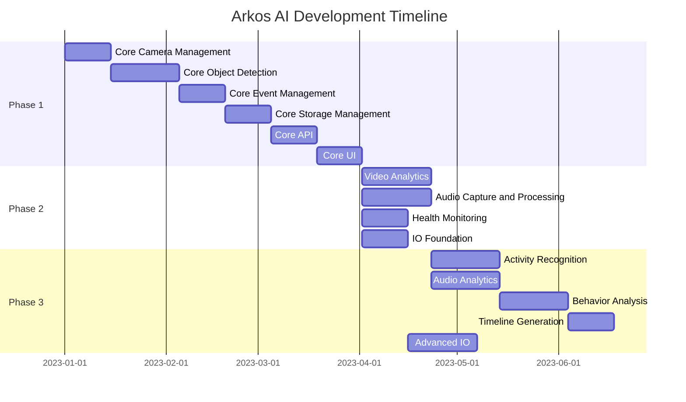

# Project Tracking

This document outlines how we track progress and manage tasks in the Arkos AI project.

## Overview

Effective project tracking is essential for managing a complex project like Arkos AI. We use a combination of tools and processes to track what has been completed and what is still to do.

## Task Tracking System

### GitHub Projects

We use GitHub Projects as our primary task tracking system. The project board is organized into the following columns:

1. **Backlog**: Tasks that are identified but not yet prioritized for the current development cycle
2. **To Do**: Tasks that are prioritized for the current development cycle
3. **In Progress**: Tasks that are currently being worked on
4. **Review**: Tasks that are completed and awaiting review
5. **Done**: Tasks that are completed and reviewed

### Issue Management

All tasks are tracked as GitHub Issues. Each issue should include:

- **Title**: A clear, concise description of the task
- **Description**: Detailed information about the task, including requirements and acceptance criteria
- **Labels**: Categorization of the issue (e.g., bug, feature, documentation)
- **Milestone**: The release or sprint the issue is targeted for
- **Assignee**: The person responsible for completing the task
- **Priority**: The importance of the task (high, medium, low)

### Issue Templates

We use issue templates to ensure consistency in how tasks are defined:

- **Bug Report Template**: For reporting bugs
- **Feature Request Template**: For requesting new features
- **Documentation Task Template**: For documentation tasks
- **Refactoring Task Template**: For code refactoring tasks

## Milestone Planning

We organize work into milestones based on the development phases outlined in the [Dependency Graph](../architecture/dependency-graph.md):

1. **Phase 1: Core Foundation**
2. **Phase 2: Enhanced Analytics**
3. **Phase 3: Advanced Features**
4. **Phase 4: Integration and Extensions**
5. **Phase 5: Advanced UI and API**

Each milestone has a set of issues assigned to it, with a target completion date.

## Progress Tracking

### Burndown Charts

We use burndown charts to track progress within each milestone. The burndown chart shows:

- **Total Story Points**: The total amount of work planned for the milestone
- **Completed Story Points**: The amount of work completed
- **Ideal Burndown Line**: The ideal progress line
- **Actual Burndown Line**: The actual progress line

### Status Reports

Weekly status reports are generated to provide an overview of progress:

- **Completed Tasks**: Tasks completed in the past week
- **In Progress Tasks**: Tasks currently being worked on
- **Blocked Tasks**: Tasks that are blocked and require attention
- **Upcoming Tasks**: Tasks planned for the next week
- **Risks and Issues**: Any risks or issues that need to be addressed

## Development Workflow

### Branch Management

We follow a branch management strategy based on the [Git Flow](https://nvie.com/posts/a-successful-git-branching-model/) model:

- **main**: Production-ready code
- **dev**: Development branch for the next release
- **feature/xxx**: Feature branches for new features
- **bugfix/xxx**: Bug fix branches
- **release/xxx**: Release branches for preparing releases

### Pull Request Process

All changes are made through pull requests:

1. Create a branch from `dev`
2. Make changes and commit
3. Create a pull request to `dev`
4. Get the pull request reviewed
5. Merge the pull request

Pull requests are linked to issues using GitHub's linking features (e.g., "Fixes #123").

## Release Management

### Versioning

We follow [Semantic Versioning](https://semver.org/) for version numbers:

- **Major Version**: Incompatible API changes
- **Minor Version**: Backwards-compatible functionality
- **Patch Version**: Backwards-compatible bug fixes

### Release Process

1. Create a release branch from `dev`
2. Perform final testing and bug fixes
3. Update version numbers and CHANGELOG.md
4. Merge to `main`
5. Tag the release
6. Create a GitHub Release with release notes

## Documentation Updates

Documentation is updated alongside code changes:

1. Update relevant documentation files
2. Include documentation changes in the same pull request as code changes
3. Update the CHANGELOG.md file with documentation changes

## Task Estimation

We use story points for estimating tasks:

- **1 Point**: Very small task, less than half a day
- **2 Points**: Small task, about half a day to a day
- **3 Points**: Medium task, about 1-2 days
- **5 Points**: Large task, about 3-5 days
- **8 Points**: Very large task, more than a week (should be broken down)

## Progress Visualization

### Kanban Board

The GitHub Projects board provides a Kanban view of tasks, showing their current status.

### Gantt Chart

For milestone planning, we use a Gantt chart to visualize the timeline:



## Task Dependencies

Task dependencies are tracked in the issue description using the "Depends on" section:

```
## Depends on
- #123 (Camera Management)
- #124 (Object Detection)
```

## Reporting and Metrics

We track the following metrics to measure progress:

- **Velocity**: Story points completed per sprint
- **Cycle Time**: Time from task start to completion
- **Lead Time**: Time from task creation to completion
- **Defect Rate**: Number of bugs per feature
- **Test Coverage**: Percentage of code covered by tests

## Tools

We use the following tools for project tracking:

- **GitHub Issues**: For task tracking
- **GitHub Projects**: For Kanban board
- **GitHub Actions**: For CI/CD and automated metrics
- **GitHub Wiki**: For additional documentation

## Regular Meetings

We hold the following regular meetings:

- **Daily Standup**: Brief update on progress and blockers
- **Sprint Planning**: Planning work for the next sprint
- **Sprint Review**: Reviewing completed work
- **Sprint Retrospective**: Reflecting on the sprint process
- **Milestone Planning**: Planning work for the next milestone

## Conclusion

This project tracking system provides a comprehensive approach to managing the Arkos AI project. By following these processes, we can effectively track what has been completed and what is still to do, ensuring that the project stays on track and meets its goals.
